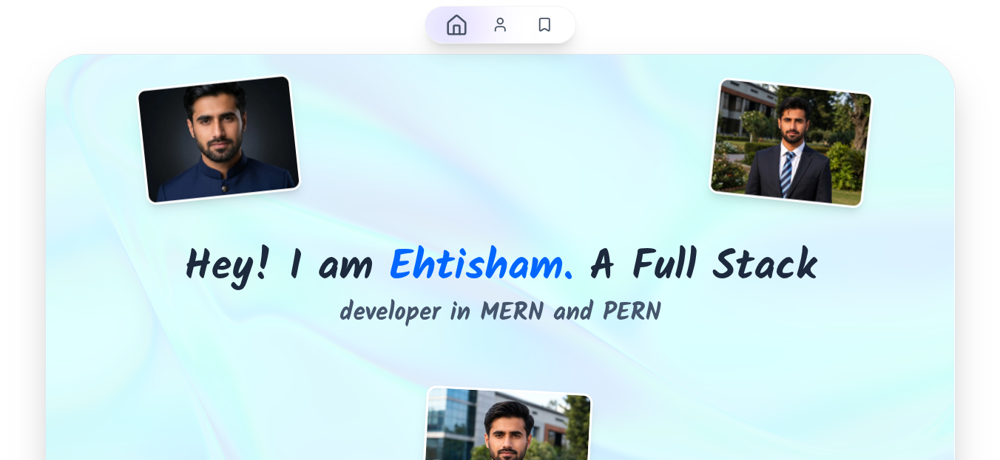

<div align="center">
  
  
  # ✨ Ehtisham's Portfolio 
  
  *A futuristic, immersive personal portfolio built with modern web technologies.*
</div>

---

## 🙋‍♂️ About Me

Hi! I'm **Ehtisham**, a Full Stack Developer passionate about crafting dynamic, responsive, and highly interactive web experiences. I specialize in bridging the gap between cutting-edge design and performant engineering.

## 🛠️ Tech Stack

This project leverages the following technologies to deliver a stunning user experience:

- **Next.js** - React framework for server-side rendering and static site generation
- **React** - UI component architecture
- **Tailwind CSS** - Rapid, utility-first styling and animations
- **Framer Motion** - Seamless spring physics animations and gestures
- **Lucide React** - Clean and modern SVG icon library
- **OGL** - Minimal WebGL library for beautiful custom shader effects

## 🚀 Setup

Follow these steps to run the project locally:

1. **Clone the repository**
   ```bash
   git clone <repository-url>
   cd portfolio
   ```

2. **Install dependencies**
   ```bash
   npm install
   ```

3. **Start the development server**
   ```bash
   npm run dev
   ```

4. **View the app**
   Open [http://localhost:3000](http://localhost:3000) in your browser.

---
<div align="center">
  <i>Crafted with ❤️ and code.</i>
</div>
